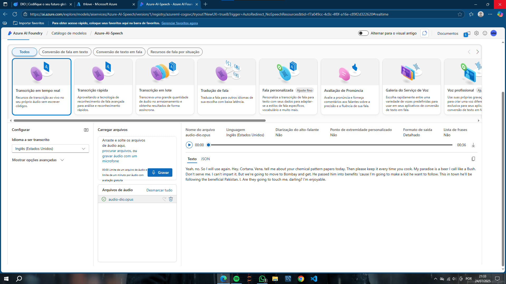
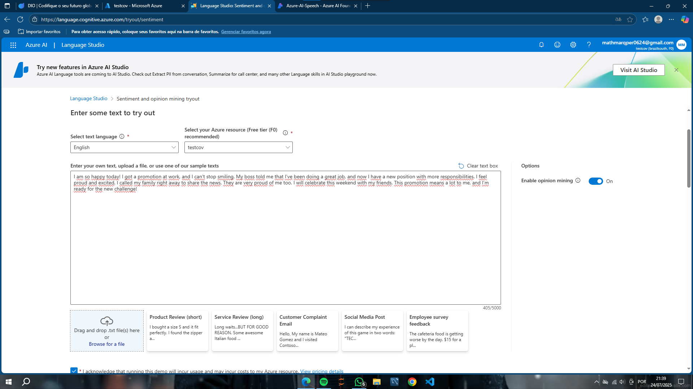
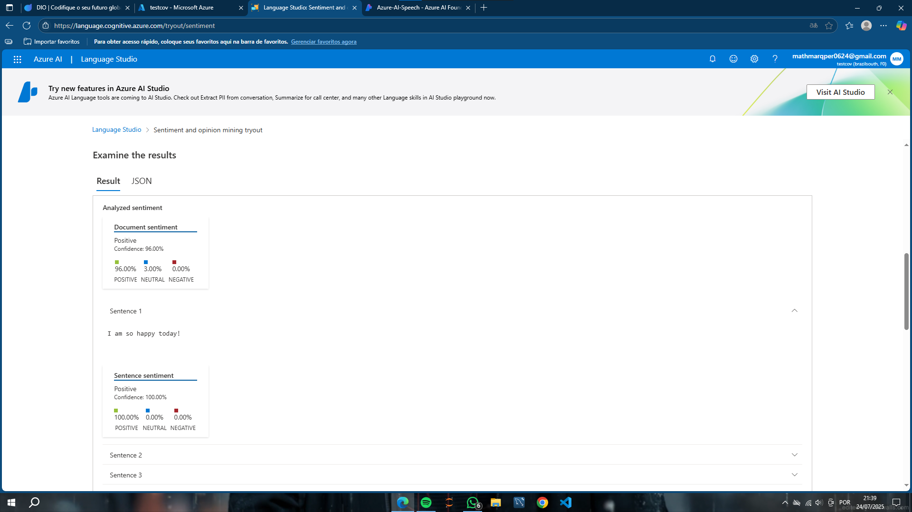

# Seja bem vindo ao meu projeto

## PT1 - Seepch

Começamos fazendo a transcrição de um audio em português para um texto em ingles usando a ferramenta da azure

## PT2 - Language

Nessa area do laboratorio do Azure ia machine learning. Vamos fazer um analise de sentimentos de um texto em ingles de uma pessoa que recebeu promoção no seu serviço

Essa foi analise obitida do texto que a ferramenta do azure coletou

